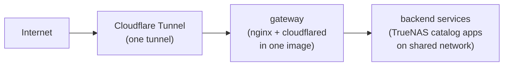

# self-hosted

Infrastructure config and containers for self-hosted services on TrueNAS, tunneled through Cloudflare for tjw.dev.

## Architecture

All public traffic flows through a single Cloudflare Tunnel to a gateway container running on TrueNAS. The gateway (nginx) routes by hostname and enforces per-service path allowlists. Backend services are installed from the TrueNAS app catalog and connected via a shared Docker network.

No ports are opened on the home network. The gateway makes outbound-only connections to Cloudflare's edge.

## Services

| Service | Subdomain | Source |
|---------|-----------|--------|
| [Umami Analytics](umami/) | `metrics.tjw.dev` | TrueNAS catalog app |

## Dependencies

- **TrueNAS SCALE** (Electric Eel / 24.10+) with Docker-based apps
- **Cloudflare** account with a domain and Zero Trust access
- **GitHub** repo with `RENOVATE_TOKEN` and `GITHUB_TOKEN` secrets

## Security

- The gateway only proxies explicitly allowed paths per service. All other requests return 404. Unknown hostnames are dropped.
- Backend admin interfaces are only accessible on the local network, never through the tunnel.
